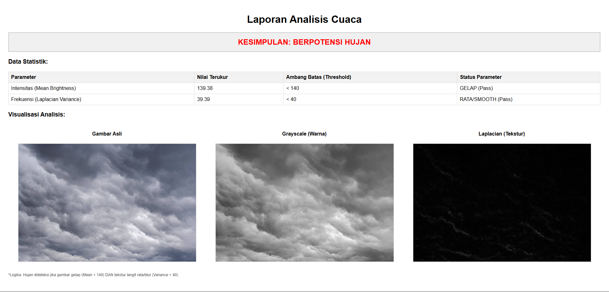

# ☁️ Cloud Rain Detector Image Processing


**A lightweight Multimedia Data Processing project that predicts rain potential based on cloud morphology and color intensity, without using Neural Networks or AI.**

## 📺 Video Demonstration

Watch the full explanation and demo of this program on YouTube:

[](https://youtu.be/RSNFxiHGMMo)

*(Click the image above to watch the video)*

---

## 📖 About The Project

In an era dominated by heavy Deep Learning models, this project demonstrates the power of **Classical Digital Image Processing**. It analyzes cloud imagery to determine weather conditions (Potential Rain vs. No Rain) by mathematically calculating pixel statistics.

**Key Features:**
* **Real-time Analysis:** Instant processing of uploaded images.
* **Visual Debugging:** Displays Original, Grayscale (Intensity), and Laplacian (Texture) views side-by-side.
* **Binary Classification:** Simple "Rain Potential" vs "No Rain Potential" output.
* **HTML Reporting:** Generates a self-contained HTML report with embedded analysis data and base64 images.

## ⚙️ How It Works (The Logic)

The system avoids "Black Box" AI by using a transparent Rule-Based Classifier based on two fundamental image properties:

### 1. Intensity Analysis (Color/Brightness)
* **Concept:** Rain clouds (*Nimbostratus*) block sunlight, resulting in darker images.
* **Method:** Converts the image to **Grayscale** and calculates the **Mean Pixel Intensity**.
* **Threshold:** If Mean < `140`, the image is considered "Dark".

### 2. Frequency/Texture Analysis (Morphology)
* **Concept:** * **Clear/Fair Weather Clouds (*Cumulus*):** Have high contrast, sharp edges, and "fluffy" details (High Frequency).
    * **Rain Clouds (*Stratus/Nimbostratus*):** Appears as a flat, uniform, gray blanket with very little texture or edge detail (Low Frequency).
* **Method:** Applies a **Laplacian Filter** (2nd derivative) and calculates the **Variance**.
* **Threshold:** If Variance < `40`, the texture is considered "Flat/Smooth".

### 3. Final Decision


The system uses a strict **AND** logic:
> **IF** (Image is Dark) **AND** (Texture is Flat) **THEN** -> 🔴 **POTENTIAL RAIN**
>
> **ELSE** -> 🟢 **NO RAIN / CLEAR**

---

## 💻 Installation & Usage

### Prerequisites
Ensure you have Python installed. Then, install the required dependencies:

```bash
pip install opencv-python numpy PyQt6
````

### Running the App

1.  Clone this repository:
    ```bash
    git clone [https://github.com/TheophilusOenjoyo/CloudRain-Detector-ImageProcessing.git](https://github.com/TheophilusOenjoyo/CloudRain-Detector-ImageProcessing.git)
    ```
2.  Navigate to the folder:
    ```bash
    cd CloudRain-Detector-ImageProcessing
    ```
3.  Run the script:
    ```bash
    python main.py
    ```

-----

## 📸 Screenshots

| Main Interface | Analysis Result | HTML Report |
|:---:|:---:|:---:|
|  |  |  |

-----

## 👤 Author

**Theophilus**

  * Project for Multimedia Data Processing System.

-----

## 📄 License

This project is open-source and available under the [MIT License](LICENSE).
